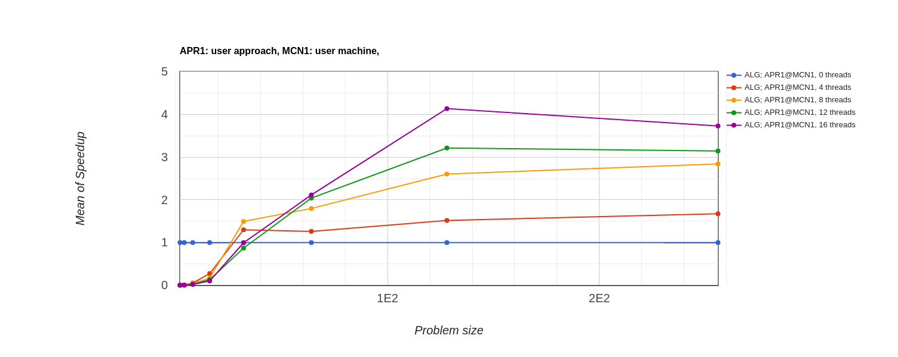
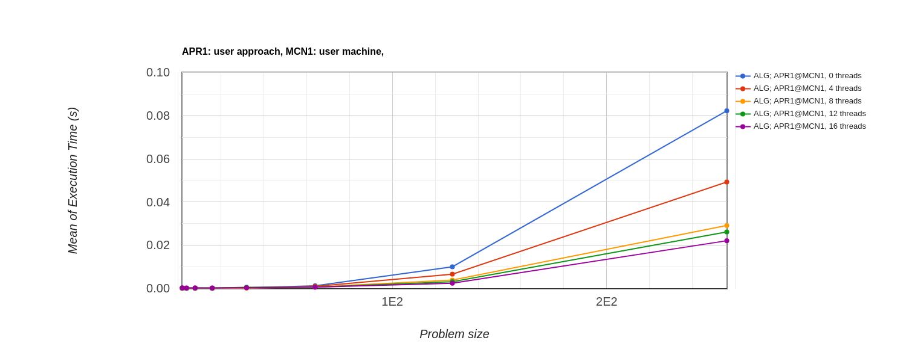
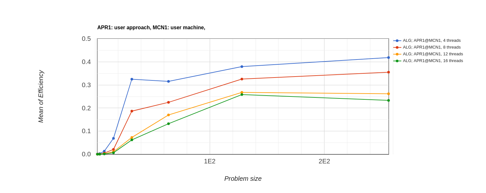

# HPC-Analysis-on-Bellman-Ford

Analysis on how parallel and serial implementation of the Bellman Ford Algorithm affects the performance.

Comparision of serial implementation and parallel implementation on 4,8, 12 and 16 processors on the grounds of speedup, execution time and effeciency.

## Requisites: 
1.C libraries: 
  _stdio.h, math.h, time.h, string.h, stdlib.h, limits.h
  _omp.h
2.Python libraries: 
  _subprocess, os, config
  
## Execution:
1. Run main.py which calls serial.c and parallel.c. 
2. Enter number of runs you want the codes to run.
3. Enter 'n' when asked if you want to reuse old data if you have changed algo or config.py

## Scalablity:
You can run the script for any algorithm by changing the algorithm inside the marked portion of core algorithm inside serial and parallel.c

## Results:
1. Speedup:
Speedup of 14 processor parallel implementation is highest and that of serial is lowest.

2. Execution Time:
Execution Time of serial is highest and that of 14 processor parallel implementation is lowest.

3. Efficiency:
Execution Time of 4 processor parallel is highest and that of 14 processor parallel implementation is lowest.

Only executing algorithmic computation steps gets us closer to the completion of the computing process. We can say then that an algorithm that minimizes the ratio of communication to computation has the best parallel efficiency. Since, 4 thread has minimum communication needed, it has the best efficiency.

## References:
1. Course website: http://letshpc.herokuapp.com/
2. Concept Of Efficiency: https://www.hpcwire.com/2008/04/18/intel_ibm_speed_through_economic_slowdown-1/

